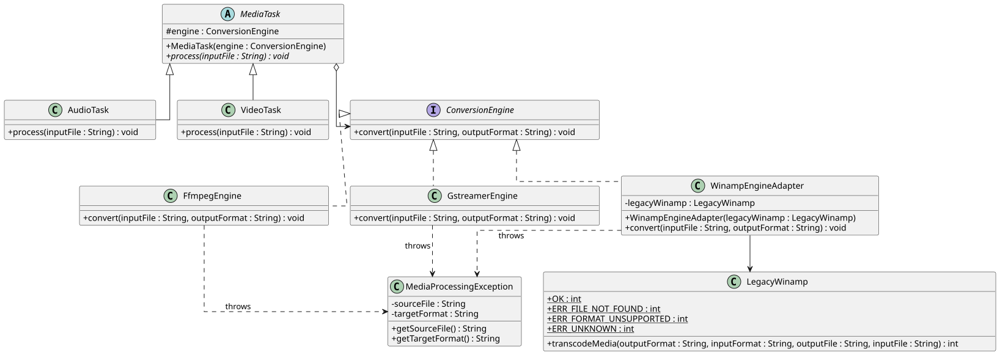

# Design Rationale - Media Converter

Complexity module chosen: Dynamic implementor selection

## Class Diagram

## Problem Domain

A media conversion system supporting multiple conversion backends. There are different tools for different filetypes: FFmpeg for common audio, GStreamer for video, and a legacy WinAmp-based library for everything else. Conversion tasks can be either audio- or video-specific and have slight variations in target format description and logging behavior.

## Why Bridge Alone Is Not Enough
Using Bridge pattern allows to decouple the task hierarchy (AudioTask, VideoTask) from the engine hierarchy (FFmpeg, GStreamer, WinAmp). However, adding another task type (e.g. SubtitleTask) would require to create new bindings for each existing engine as well as a new subclass for each existing task. Such approach would lead to combinatorial explosion. The Bridge pattern alone assumes that all implementations can be bound to the same abstraction, but in our case LegacyWinamp has a different API which cannot be reasonably adapted to the ConversionEngine interface directly.

## Why Adapter Alone Is Not Enough
While the Adapter pattern hides differences in the legacy WinAmp library, it only solves the problem for one particular class. We would still need to create numerous bindings between Task and ConversionEngine subclasses. Without Bridge there would be no way to vary the task implementation independently from the engine implementation. For example, adding a new VideoTask would require to create VideoTaskFFmpeg, VideoTaskGStreamer and VideoTaskWinamp classes.

## Why LegacyWinamp Is Genuinely Incompatible
There are three fundamental reasons why the LegacyWinamp library cannot be used directly: the method name is different (transcodeMedia vs convert), it takes 4 arguments vs 2, and it returns integer error codes vs throwing exceptions. The WinampEngineAdapter class solves the problem by adapting all three differences: renaming the method, reordering the parameters, and converting error codes to exceptions.

## Dynamic Implementor Selection
The App.selectEngine(filename) method uses the file extension to choose between available ConversionEngine implementations. The client code (main method) does not contain any references to specific engine classes. This satisfies the dynamic implementor selection complexity module as it demonstrates that the concrete implementation (WinampEngineAdapter) can be chosen at run-time depending on the input without requiring changes to the task classes themselves.
